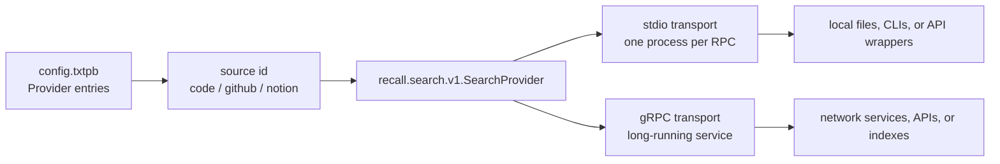
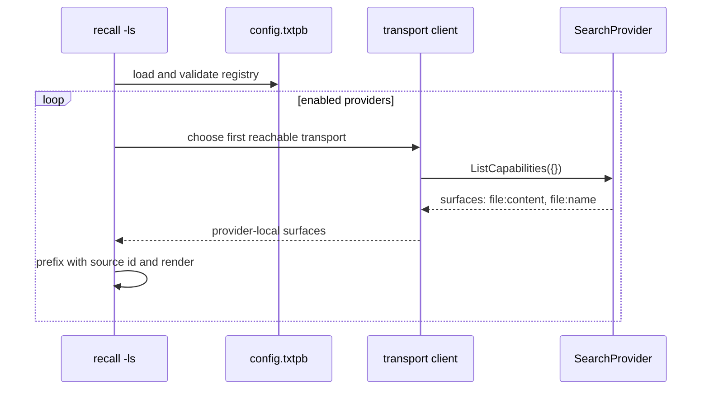
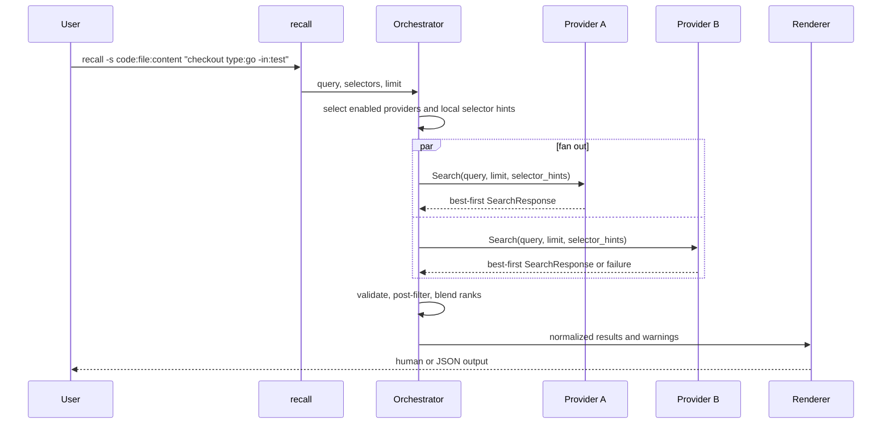

# recall architecture

`recall` is a federated search orchestrator. It gives every configured source the same discovery and search shape, while each provider keeps the source-specific behavior that makes that source useful.

The protobuf files are the center of the implementation contract:

- [proto/recall/config/v1/config.proto](../proto/recall/config/v1/config.proto) defines the operator-owned provider registry, transport choices, fallback order, ranking weight, timeout, result limit, and openers.
- [proto/recall/search/v1/search.proto](../proto/recall/search/v1/search.proto) defines the provider-facing `SearchProvider` service, selector taxonomy, request shape, result fields, warnings, groups, and open targets.

Code comments in those proto files are authoritative for field-level behavior. This document explains the higher-level choices and flow.

## Why protobuf is the contract

Protobuf gives recall one schema language for both configuration and provider RPC payloads.

For configuration, the registry is written as textproto so operators can review and edit it directly, while recall still decodes it into typed messages and validates semantic constraints before use. The protobuf shape handles field names, types, `oneof` transport selection, optional values, and forward-compatible field numbering. The Go validation layer adds rules protobuf cannot express, such as required provider IDs, positive timeouts, unique IDs, and valid opener filters. See [internal/config/config.go](../internal/config/config.go).

For provider calls, the same protobuf message definitions travel over local stdio RPC or network gRPC. Recall uses compact binary protobuf for normal stdio calls and gRPC uses the standard protobuf wire format. The provider SDK can also auto-detect textproto for direct human testing. See [internal/stdiorpc/stdiorpc.go](../internal/stdiorpc/stdiorpc.go) and [provider/provider.go](../provider/provider.go).

This gives recall a stable contract without freezing the ecosystem. New fields can be added with new tag numbers, removed fields can be reserved, and breaking changes can move to a new versioned package such as `recall.search.v2`.

## Sources, providers, and transports

A source is the logical corpus operators search, identified by the configured provider `id`, such as `code`, `github`, `notion`, or `jira`. A provider is the implementation of that source. A transport is only how recall reaches that provider.

That means local and remote sources use the same provider contract:

- A local source can be a stdio provider that wraps files, a local index, or another CLI. Recall starts it for one unary RPC call and passes the method path plus protobuf bytes.
- A remote source can be a gRPC provider that runs as a service near an API, index, or network-only data store. Recall calls the same `SearchProvider` methods over the network.
- A stdio provider can also wrap a remote API, and a gRPC provider can expose local infrastructure. Local vs. remote is an operational choice, not a different search model.



## Transport fallback

Each provider can declare multiple transports. Recall tries them in config order and uses the first transport that can be reached.

```textproto
providers {
  id: "code"
  enabled: true
  transports { grpc { endpoint: "dns:///recall-code.internal:443" } }
  transports { stdio { command: "recall-ripgrep-provider" args: "--root" args: "." } }
  weight: 1
  timeout_ms: 3000
  default_limit: 20
}
```

Fallback is deliberately narrow: later transports are tried only when an earlier transport cannot be dialed or resolved. Once recall has a client, RPC errors from `ListCapabilities` or `Search` are reported as provider failures instead of silently retrying another implementation. This keeps fallback useful for availability while avoiding inconsistent results from multiple live backends. See [internal/searchclient/client.go](../internal/searchclient/client.go).

## Capability discovery

`recall -ls` asks each enabled provider for the provider-local surfaces it can search. Providers return selectors like `file:content`, `file:name`, or `pr:content`; recall prefixes them with the configured source id before showing them to operators, such as `code:file:content`.



`ListCapabilities` should be cheap and should not perform a remote search. It is for discovery and routing, not for proving that every downstream dependency is healthy. Provider capability implementations live with each provider, for example [providers/ripgrep/provider.go](../providers/ripgrep/provider.go) and [providers/gh/provider.go](../providers/gh/provider.go).

## Search flow

Search has two responsibilities split across recall and providers:

- recall owns source selection, fan-out, response validation, selector post-filtering, cross-provider blending, rendering, JSON output, and open-target wiring;
- providers own authentication, indexing, source-native query semantics, source-native result ordering, field mapping, warnings, groups, and open targets.



Selector hints are advisory inputs for providers. If the operator selects `code:file:content`, recall sends `file:content` to the `code` provider as a hint so the provider can skip unneeded work. Recall still validates every result and applies authoritative selector filtering after responses return. This lets providers optimize without making selector correctness depend on provider cooperation. See [internal/orchestrator/search.go](../internal/orchestrator/search.go) and [internal/normalize/response.go](../internal/normalize/response.go).

## Query semantics stay provider-owned

The `SearchRequest.query` field is raw provider-native text. Recall does not define a universal query language after it has parsed recall-owned flags and source selectors.

That is intentional. A code provider may interpret `type:go -in:test` as ripgrep filters, a GitHub provider may accept `repo:owner/name is:open`, a notes provider may use full-text search, and a calendar provider may eventually interpret dates or attendees. Forcing one query contract would either erase useful source-native features or turn recall into a lowest-common-denominator parser.

The stable recall contract is instead:

- selectors route queries to sources and coarse surfaces;
- query text remains provider-owned;
- providers return structured results with typed fields and open targets;
- recall validates the structure and presents it consistently.

## Ranking and rendering

Providers return results in best-first order according to their own relevance model. Recall treats provider-native scores as diagnostics because scores from different systems are not comparable. Cross-provider ordering uses provider-local rank plus the configured provider `weight`; the initial implementation is reciprocal-rank fusion. See [internal/rank/rank.go](../internal/rank/rank.go).

Rendering stays generic because providers return typed fields and format hints rather than provider-specific display objects. Human output can group by source and source-native group, while JSON preserves the structured protobuf-derived fields for tools and agents.

## Implementation map

- Provider and config contracts: [proto/recall/search/v1/search.proto](../proto/recall/search/v1/search.proto), [proto/recall/config/v1/config.proto](../proto/recall/config/v1/config.proto)
- Config loading and validation: [internal/config/config.go](../internal/config/config.go)
- Transport-independent client and fallback: [internal/searchclient/client.go](../internal/searchclient/client.go)
- Stdio RPC transport: [internal/stdiorpc/stdiorpc.go](../internal/stdiorpc/stdiorpc.go)
- Search orchestration and selector routing: [internal/orchestrator/search.go](../internal/orchestrator/search.go)
- Response validation and normalization: [internal/normalize/response.go](../internal/normalize/response.go)
- Cross-provider blending: [internal/rank/rank.go](../internal/rank/rank.go)
- Public Go provider SDK: [provider/provider.go](../provider/provider.go)
- Provider compatibility guide: [docs/recall-compatible-search.md](recall-compatible-search.md)
